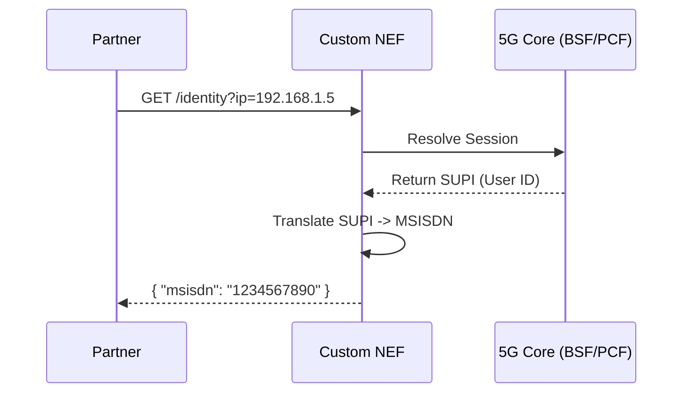
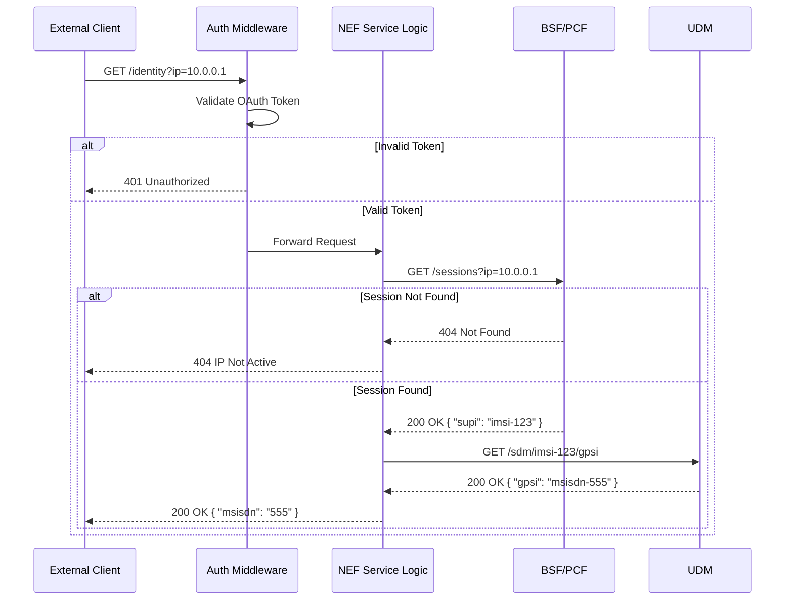
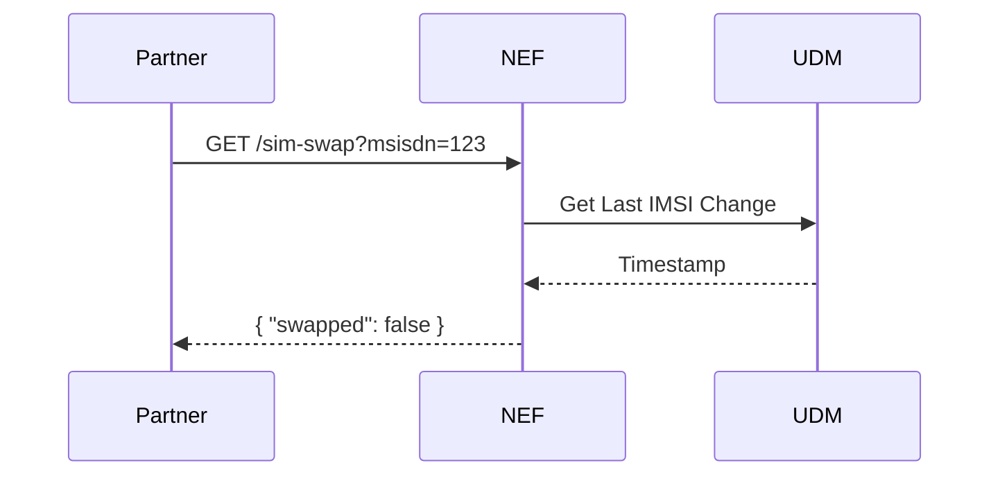
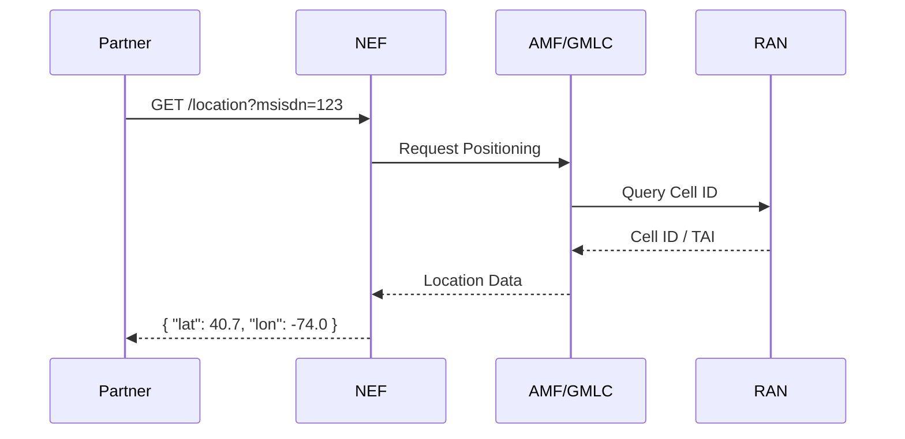
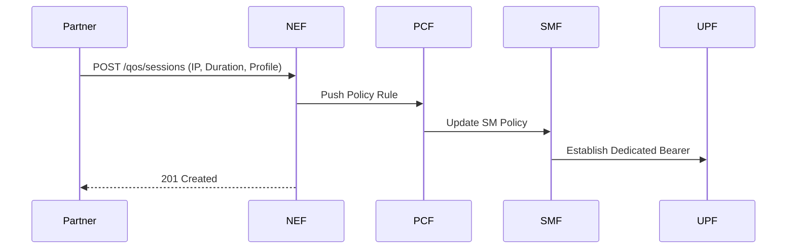

# Northbound API (NEF) Design: API Catalog & Flows

## 1. Executive Summary
This document outlines the design for a **Northbound API (NEF)** acting as a secure gateway for external partners to access network capabilities. It details the **Architecture** and **High-Level/Low-Level Designs** for four key APIs:
1.  **Identity** (IP to MSISDN)
2.  **SIM Swap** (Validation)
3.  **Location** (Device Positioning)
4.  **Quality on Demand** (QoS Boost)

## 2. Architecture Overview
The system follows the 3GPP **Network Exposure Function (NEF)** architecture.
*   **External**: Partners authenticate via OAuth2.
*   **Internal**: NEF communicates with 5G Core functions (BSF, UDM, AMF, PCF) via Service-Based Interfaces (SBI) using HTTP/2.

## 3. API 1: Identity (IP to MSISDN)

### 3.1 High-Level Design (HLD)



### 3.2 Low-Level Design (LLD)

**Component Interaction Detail**:
1.  **Ingress**: API Gateway validates Partner Bearer Token.
2.  **Resolution Step 1 (IP -> SUPI)**: 
    *   NEF invokes **BSF** service: `Nbsf_Management_Discovery`.
    *   *Query*: `GET .../bsf/management/v1/sessions?ip_address=192.168.1.5`
    *   *Result*: JSON containing `supi` (e.g., `imsi-208930000000001`) and `pcfId`.
3.  **Resolution Step 2 (SUPI -> MSISDN/GPSI)**:
    *   NEF invokes **UDM**: `Nudm_SDM_Get`.
    *   *Query*: `GET .../nudm-sdm/v1/{supi}/gpsi`
    *   *Result*: JSON containing `gpsi` (Generic Public Subscription Identifier), typically `msisdn-1234567890`.



## 4. API 2: SIM Swap Check

### 4.1 High-Level Design (HLD)
Partners check if a SIM card has been changed recently to prevent fraud (e.g., before high-value transactions).



### 4.2 Low-Level Design (LLD)
1.  **Input**: MSISDN to be checked.
2.  **Translation**: NEF maps MSISDN -> SUPI (via internal cache or UDM query).
3.  **Core Query**:
    *   NEF calls **UDM**: `Nudm_UECM_Get` (UE Context Management).
    *   *Resource*: `/uecm/v1/{supi}/registrations/amf-3gpp`
    *   *Response*: Includes `registrationTime` or specific `lastImsiChange` metadata.
4.  **Logic**: Compare `registrationTime` vs. Partner's `max_age` or return boolean.

## 5. API 3: Location (Device Positioning)

### 5.1 High-Level Design (HLD)
Retrieve the geographical location of a UE.



### 5.2 Low-Level Design (LLD)
1.  **Core Query**:
    *   NEF invokes **AMF**: `Namf_Location`.
    *   *Operation*: `ProvidePositioningInfo`.
    *   *Payload*: `{ "supi": "...", "externalClientType": "PARTNER" }`
2.  **Processing**:
    *   AMF returns `UserLocation` (TAI, ECGI).
    *   NEF maps `ECGI` (Cell ID) to Lat/Lon using a GIS database (local or external).

## 6. API 4: Quality on Demand (QoD)

### 6.1 High-Level Design (HLD)
Request dedicated network resources (low latency/high bandwidth) for a specific application session.



### 6.2 Low-Level Design (LLD)
1.  **Core Query**:
    *   NEF invokes **PCF**: `Npcf_PolicyAuthorization`.
    *   *Operation*: `PostAppSessions`.
    *   *Payload*:
        ```json
        {
          "ueIpv4": "10.0.0.5",
          "ascReqData": {
            "flowDescription": "permit out ip from 10.0.0.5 to ...",
            "tosTrafficClass": "GOLD_TIER"
          }
        }
        ```
2.  **Effect**: PCF triggers `Npcf_SMPolicyControl_Update` to the SMF, which modifies the UPF packet filter rules.
